# partile — Ürün Araştırması & Plan

> Kaynaklar: `PLAN_Urun_Stratejisi_UX_UI_Moodboard_v2.docx` + partiful.com public sayfalarının incelemesi (26 Eylül 2026).
> Ekran görüntüleri: `research/screens/` · Ham sayfa metinleri: `research/text/`

---

## 1. Planın okunması — netleştirilen noktalar ve kararlar

Plan sağlam; aşağıdakiler belirsizdi veya Partiful incelemesiyle çelişiyordu. Her biri için varsayılan bir karar aldım (değiştirmek istersen söylemen yeterli).

| # | Konu | Plandaki durum | Karar (varsayılan) |
|---|------|----------------|--------------------|
| 1 | İsim | Çalışma adı "PLAN" | Ürün adı **partile**. Kısa link: `partile.co/e/{id}` gibi (domain henüz belirsiz). |
| 2 | Platform sırası | "Expo/RN Web veya Next.js PWA" | **Önce Next.js web app (mobile-first)**, sonra **Expo React Native**. Monorepo (Turborepo): `apps/web`, `apps/mobile`, `packages/ui-tokens`, `packages/core` (tipler, validasyon, API client). Tokenlar baştan paylaşılır. |
| 3 | Görsel dil | Açık tema, Plan Purple #6657FF, sakin "Apple Calendar" hissi | Partiful'ün gücü **her etkinliğin kendi teması** (tam ekran gradient/tema arka planı + poster + font + efekt). Karar: **uygulama kabuğu (home, profil, ayarlar) planın paletinde; etkinlik sayfası/davetiye ise tema sistemiyle** renklenir. Böylece hem "sakin" hem "Instagram Story enerjisi" sağlanır. |
| 4 | Auth | Belirsiz | Partiful gibi **telefon + SMS OTP** (Partiful TR +90 destekliyor). Misafir RSVP'de sadece **isim + telefon**; şifre yok. Plandaki "login wall yok" ile uyumlu: misafir önce RSVP eder, OTP ile doğrular. SMS sağlayıcı: Netgsm / İleti Merkezi (TR maliyeti düşük), alternatif Twilio Verify. |
| 5 | WhatsApp | Dağıtım kanalı | Partiful'deki SMS "Text Blast" → partile'de **WhatsApp paylaşım kartı + (Faz 1 sonu) WhatsApp Business API ile duyuru**. MVP'de duyurular: push + SMS + e-posta; WhatsApp şablon onayı sonra. |
| 6 | "Tarih anketi" vs RSVP | 90 gün sorusu | Partiful'de de "Can't decide? Poll your guests" create ekranının merkezinde. MVP'de ikisi de var; anket, create ekranında tarih alanının hemen altında. |
| 7 | Görünürlük | Private-first | Partiful ile aynı: **Private (linke sahip olanlar)** / **Public** seçimi create'te var, fakat Public ve Explore Faz 2'de açılacak (toggle MVP'de gizli). |
| 8 | Guest list gizliliği | Belirsiz | Partiful: **misafir listesi ve aktivite yalnızca RSVP verenlere açık** ("Restricted Access"). Aynı model alınır; ayrıca "RSVP'den sonra konumu gör" seçeneği. |
| 9 | Ödeme | Faz 3 | Partiful'de iki mod: **Sell Tickets** ve **Split Costs / Chip In**. TR: iyzico / PayTR (bilet), "Masrafı böl" için ilk aşamada sadece IBAN/Papara linki + tutar gösterimi (para tutmadan). Gerçek ödeme Faz 3. |
| 10 | Mevzuat | Yok | **KVKK** aydınlatma + açık rıza (telefon numarası), **İYS/ETK** (ticari SMS izni — hatırlatma SMS'i işlem mesajı sayılır, pazarlama sayılmaz), çerez politikası. |
| 11 | AI | Metinden plan önerisi | Partiful'de "Party Genie" var (uygulama içi). partile'de create ekranındaki serbest metin ("Cumartesi 8-10 kişi doğum günü yemeği…") → başlık/emoji/tarih/tema önerisi. Claude API ile, sonuç her zaman düzenlenebilir form alanlarına dolar. |
| 12 | Premium | "Premium host" Faz 1 sonu | Partiful'de bazı tema/efektlerde **taç (👑) rozeti** = premium. Aynı desen: ücretsiz temel + premium tema/efekt paketleri. |

**Açık kalan (şimdilik bloklamayan) sorular:** domain, SMS sağlayıcı seçimi, marka logosu. Tasarım aşamasında placeholder ile ilerlenebilir.

---

## 2. Partiful public sayfaları — inceleme

İncelenen sayfalar: `/`, `/create`, `/explore`, `/e/{id}` (public etkinlik), `/u/{id}` (organizatör profili), `/login`, `/org-profiles`, `/ticketing`, `/birthday-party-invitations`, `/dinner-invitations`, `/housewarming-invitations`, `/halloween`, `/about`, `/community-guidelines`, `/download`.

### 2.1 Site haritası ve navigasyon
- **Üst nav (landing):** Halloween · Birthdays · Dinners · Housewarmings · For Orgs · Sell Tickets · Explore · Login · Create
- **Mobil web alt tab bar:** Home · Create (+) · Explore (🌐) · Profile
- **Footer:** Explore events · Create a free event · dil seçici · Help · Blog · Careers · About · Get the app
- **Viral döngü:** Her etkinlik sayfasının tepesinde yapışkan banner: *"Events can be easy 🕺 — Make your own"*.

### 2.2 Landing (`/`)
- Hero: "Parties are back — The easiest way to get your guests on the same page" + **Create invite**
- "Fun, modern invites in 1-click — 100% free, no paywalls" → 4 özelleştirme ekseni: **Backgrounds · Fonts · Animations · Posters**
- **Trending Templates** carousel (her biri `/create?theme=…&effect=…&poster=…&titleFont=…` deep-link'i → şablon = parametre seti)
- Özellik blokları: Sell tickets · See who's going (yorum, reaksiyon) · Text Blast · Find a time (tarih anketi) · Get answers upfront (soru formu) · Collect payments · Send invites on any platform · Shared photo album
- Sosyal kanıt: basın alıntıları marquee, App Store yorumları (5.0 • 217K)

### 2.3 Create (`/create`) — ürünün kalbi, login gerektirmiyor
Tek ekran, "gördüğün = misafirin göreceği" (WYSIWYG) davetiye editörü:
1. **Başlık** ("Untitled Event") + **başlık fontu çipleri:** Classic · Eclectic · Fancy · Literary · Digital · Elegant · Simple
2. **Poster** (kare görsel) + *Edit* (galeri/GIF/yükle, sürükle-bırak)
3. **Set a date…** → tam ekran sheet: Start Date › (opsiyonel) End Date, takvim, Start Time, saat dilimi, Confirm
4. *"Can't decide? Poll your guests →"* (tarih anketi)
5. Alan listesi (ikonlu satırlar): Hosted by (host nickname) · Location · Unlimited spots (kapasite) · Cost per person [**Sell tickets** rozeti]
6. Ek çipler: **+ Link · + Playlist · + Registry · + Dress code**
7. Açıklama + *"More to say? + New section"*
8. **Who can find this event?** Private (Only people with the link) / Public (Anyone on or off Partiful)
9. **RSVP Options:** glyph seti (👍 Emojis → Going 👍 / Maybe 🤔 / Can't Go 😢)
10. **Quick actions for hosts:** Collect Info (soru formu) · Reminders · Require Guest Approval · More
11. **Alt sabit bar:** Theme · Effect · Settings · Preview + **Save draft**

**Bottom sheet'ler:**
- *Theme:* kategori çipleri (All · 🔥 Trending · 🌕 Light · 🐒 Fun · …), dairesel swatch'lar, renk seçici, 🎲 rastgele; 👑 = premium
- *Effect:* (All · Fun · Classic · Seasonal) — konfeti, kalpler, fiyonklar, sakura vb. ekran üstü animasyonlar
- *Event Settings:* sekmeler **Hosts · RSVPs · Cost Per Person**
  - Questionnaire: Short Answer / seçenekli, Required, + Add question
  - Reminders: "Reminders to RSVP — 1 hafta önce (Invited, Maybe)", "Event Reminders — 2 saat önce (Going)"
  - Cost: **Sell Tickets** | **Split Costs**
- *Preview:* misafir görünümü + "Example for preview" guest list

### 2.4 Etkinlik sayfası / misafir görünümü (`/e/{id}`)
- Tema arka planı tam ekran, ortalanmış büyük başlık, poster
- Tarih (büyük) + saat + saat dilimi
- **Yapışkan RSVP hapı:** `👍 RSVP | ☆ Interested` (public) — private'ta üç büyük yuvarlak buton: Going / Maybe / Can't Go
- *Remind me later* · `…` menü
- Hosted by (avatar, "27 upcoming events", **Follow**)
- Konum (private'ta "RSVP to see location")
- Açıklama
- **Guest List:** "489 Going · 602 Interested · 35 Maybe" + avatar stack + View all
- **Restricted Access** kartı: "Only RSVP'd guests can view event activity & see who's going" → *RSVP for access* / *Already RSVP'd? Sign in*
- Tam guest list web'de değil, app'e yönlendiriyor ("Available on app only")

### 2.5 Explore (`/explore`) & organizatör profili (`/u/{id}`)
- Explore: şehir bazlı (NYC, LA, SF, Boston, DC, Chicago, London, Miami, Austin); her şehirde kürasyon/organizatör satırları; kart = kapak + başlık + "Sat, Oct 17 at 1pm · New York" + "1,108 Interested"
- Profil: isim, bio, **Message · Follow**, "Shared Mutuals", Upcoming Events listesi
- For Orgs: kişisel ↔ organizasyon profili arasında geçiş, co-admin, tekrar eden topluluk

### 2.6 Login (`/login`)
- Tek alan: **ülke kodu + telefon numarası** → SMS kodu. Türkiye (+90) listede var. E-posta/şifre yok.

### 2.7 Tasarım sistemi gözlemleri
- Fontlar: **PartifulGrotesk** (başlık/marka), **Lausanne** (gövde), başlık font seçenekleri için Goodman, Snell (script), LibreBaskerville, Nokja, Engravers, Manrope
- Tokenlar: spacing 2/4/8/12/16/24/40 · radius 4 / 12 / pill (800px) · metin 10–52px ölçeği · animasyon 100/150/200/300/600ms
- Kabuk koyu (#111 civarı) + beyaz pill butonlar; içerik yarı saydam "glass" kartlar (tema üstünde border + blur)
- İmza bileşenler: yuvarlak RSVP emoji butonları, sticky RSVP hapı, glass alan satırları, alt tab bar, bottom sheet swatch'lar

---

## 3. Türkiye yerelleştirmesi (partile)

### 3.1 Terminoloji
| Partiful | partile |
|---|---|
| Event / Invite | Plan / Davetiye |
| Create invite / Create event | Plan oluştur |
| RSVP | Katılım / "Geliyor musun?" |
| Going · Maybe · Can't Go | **Geliyorum · Belki · Gelemiyorum** |
| Interested | İlgileniyorum |
| Remind me later | Sonra hatırlat |
| Hosted by | Düzenleyen |
| Co-host | Ortak düzenleyen |
| Guest List | Katılımcılar |
| Text Blast | Duyuru gönder |
| Collect Info / Questionnaire | Misafirlere sor |
| Require Guest Approval | Katılım onayı iste |
| Unlimited spots | Kontenjan yok |
| Cost per person | Kişi başı tutar |
| Split Costs / Chip In | Masrafı böl |
| Sell Tickets | Bilet sat |
| Poll your guests | Misafirlere sor: hangi gün? |
| Save draft | Taslağı kaydet |
| Theme · Effect · Settings · Preview | Tema · Efekt · Ayarlar · Önizle |
| Private / Public | Gizli (linke sahip olanlar) / Herkese açık |
| Restricted Access | Katılımcılara özel |
| Explore | Keşfet |
| Events can be easy 🕺 — Make your own | Plan yapmak bu kadar kolay 🕺 — Sen de oluştur |
| Date & Time TBD | Tarih netleşmedi |
| RSVP to see location | Konumu görmek için katılımını bildir |
| + Link · Playlist · Registry · Dress code | + Link · Çalma listesi · Hediye listesi · Kıyafet kodu |

### 3.2 Başlık font çipleri (TR karakter desteği şart: ğ ş ı İ ç ö ü)
Klasik · Eklektik · Şık · Edebi · Dijital · Zarif · Sade — hepsi Türkçe glyph destekli fontlardan seçilmeli (Google Fonts: ör. Bricolage Grotesque, Instrument Serif, Fraunces, Space Grotesk, Caveat, DM Serif Display, Manrope).

### 3.3 Landing SEO sayfaları (Partiful'deki occasion sayfalarının TR karşılığı)
Partiful: Halloween, Birthdays, Dinners, Housewarmings. partile:
- **Doğum günü davetiyesi** (`/dogum-gunu-davetiyesi`)
- **Ev partisi / Yeni ev** (`/ev-partisi-davetiyesi`)
- **Akşam yemeği & brunch** (`/yemek-davetiyesi`)
- **Yılbaşı** (sezonluk, Halloween'in yerine — Kasım-Aralık)
- **Mezuniyet**, **Bekarlığa veda**, **Kına gecesi / nişan** (TR'ye özgü güçlü kategori)
- **Maç izleme**, **Mangal / piknik**, **Oyun gecesi**
- Sezonluk efektler: Yılbaşı (kar), Sevgililer Günü, Bayram, Cumhuriyet Bayramı (29 Ekim), Hıdırellez, yaz/sahil

### 3.4 Format ve kültürel ayarlar
- Tarih: `Cumartesi, 17 Ekim` · saat 24h `20:00` · hafta **Pazartesi** başlar · saat dilimi sabit **TSİ (Europe/Istanbul)**, seçici gizli
- Telefon: varsayılan +90, `5XX XXX XX XX` maskesi
- Para: `₺250` / "kişi başı 250 TL"
- Konum: Google Maps + **Yandex/Apple Maps** linki; semt (Kadıköy, Moda, Cihangir) gösterimi — adres yerine "Kadıköy" gibi kısa gösterim + tam adres RSVP sonrası
- Paylaşım: birincil **WhatsApp** (OG preview kartı Türkçe, poster + tarih + "Geliyor musun?"), ikincil Instagram Story, kopyala, QR
- Explore şehirleri (Faz 2): İstanbul (Avrupa/Anadolu), Ankara, İzmir
- Ton: samimi "sen" dili, emoji kontrollü

---

## 4. Login sonrası inceleme (Adım 3)

> Oturum açık Partiful hesabıyla web'de (masaüstü, 1280px) 26 Eylül 2026'da incelendi. Ekran görüntüleri: `research/screens/app/`.
> Kurallar: gerçek etkinlik oluşturulmadı (Save draft / Publish'e basılmadı), kimseye mesaj/davet/Text Blast gönderilmedi, hiçbir ayar kaydedilmedi. Hesapta host edilen etkinlik olmadığı için host araçlarının bir kısmı (guest list yönetimi, Text Blast, check-in) Partiful Help Center'dan (`help.partiful.com` → *Partiful for Hosts*) derlendi, bunlar **[HC]** ile işaretli.
> Telefon numarası içeren görseller maskelendi.

### 4.1 Uygulama kabuğu ve navigasyon
- **Sol dikey sidebar (ikon rail, hover'da etiketli açılır):** Home · Explore · Create · Send a card · Messages · Notifications — altta Settings ve Profile (profil değiştirici oklu).
- **Sağ üst:** `Get the app` · `+ Create` · hamburger menü → profil kartı ("See your profile"), **New event** (gradient vurgulu), **Send a card**, Messages, Mutuals, Feedback, Help Center, Profile Settings, Log out.
- Kabuk koyu (#111) + üstte mor/pembe gradient "aura"; etkinlik sayfalarında kabuk etkinliğin temasına bürünür.

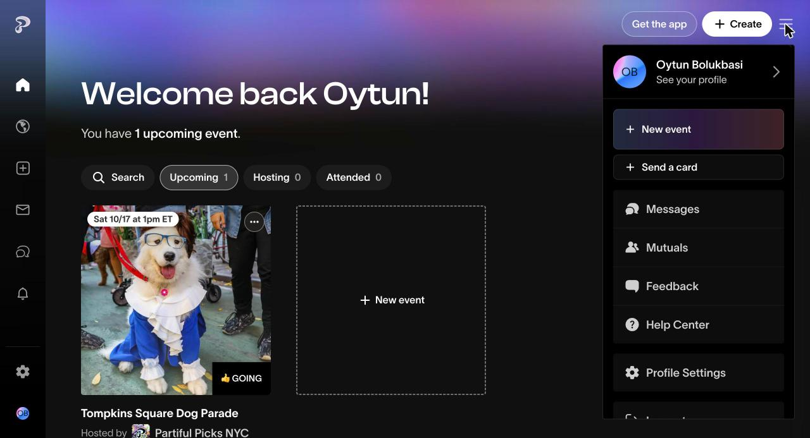
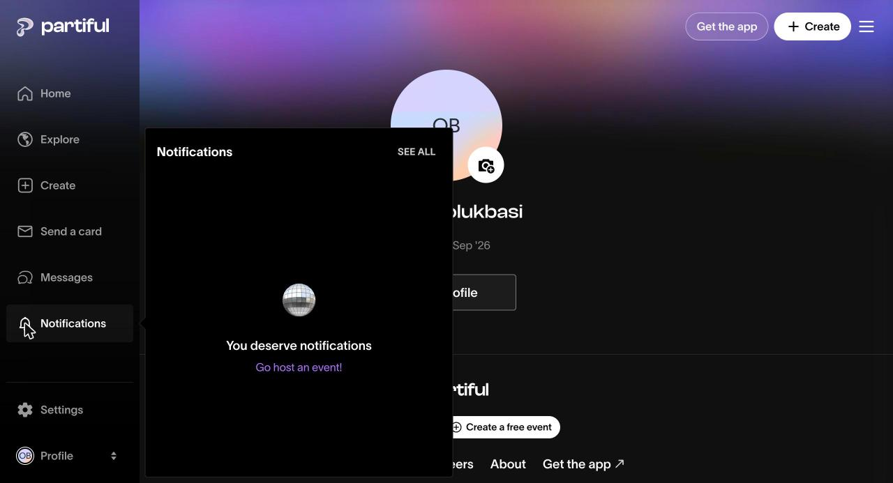

### 4.2 Home (`/events`)
- Başlık: **"Welcome back {isim}!"** + "You have 1 upcoming event."
- Filtre çipleri: **Search · Upcoming (n) · Hosting (n) · Attended (n)**. *Web'de "Drafts" sekmesi ve "Party Genie" AI önerisi görünmüyor* — ikisi de yalnızca mobil uygulamada (planın varsayımı düzeltildi).
- Etkinlik kartı: kare kapak, sol üstte tarih rozeti ("Sat 10/17 at 1pm ET"), sağ altta RSVP durumu ("👍 GOING"), altında başlık + "Hosted by". Her zaman yanında kesikli çerçeveli **"+ New event"** kartı (boş durum = CTA).
- Kart `…` menüsü: **Sync all events to calendar · Mute event · Remove me from event**.
- Alt bölümler: **Your Cards** ("Create a Digital Card — For birthdays, announcements, and more!") ve **Mutuals** (boş: "No mutuals yet — Check back here when you go to your first event!").

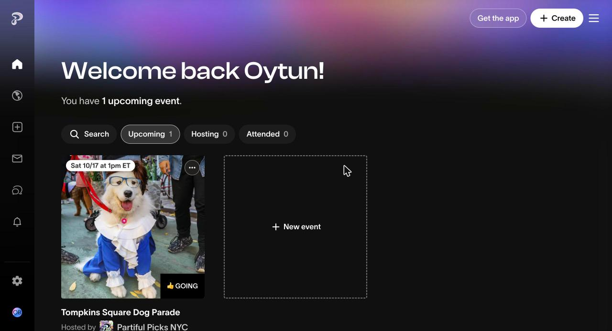
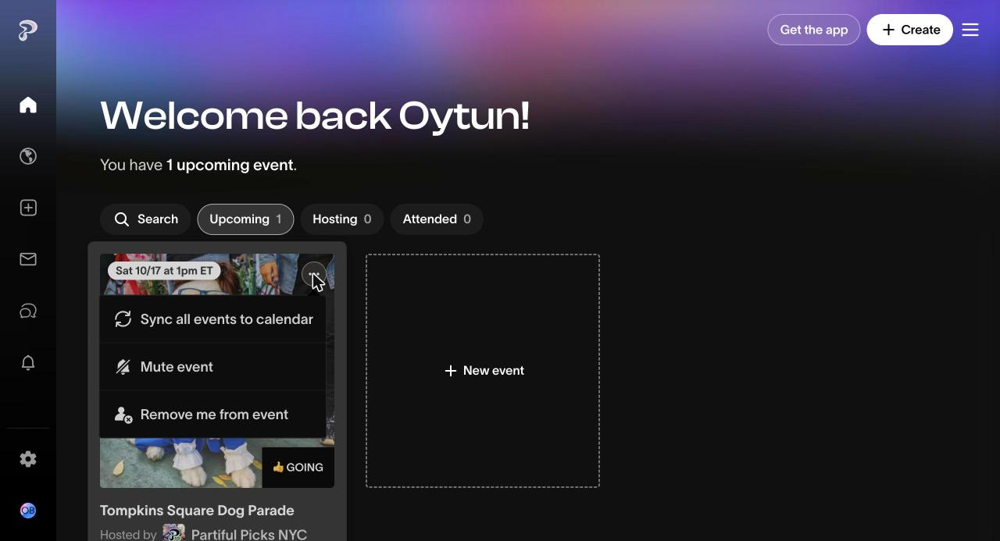
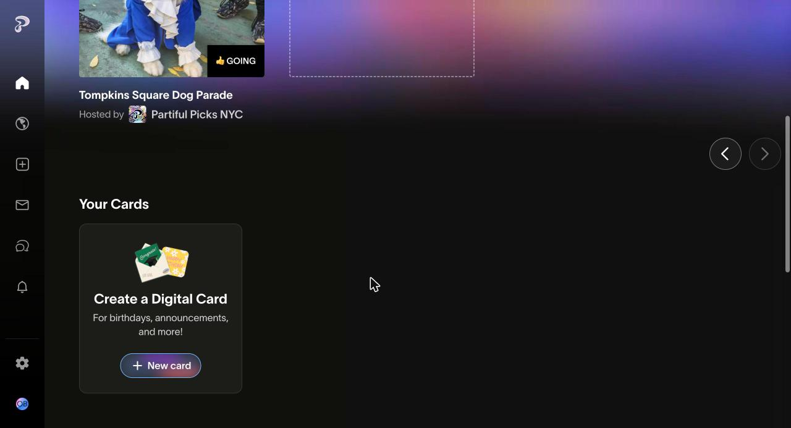

### 4.3 Etkinlik sayfası — RSVP vermiş misafir görünümü (`/e/{id}`)
RSVP sonrası "Restricted Access" kilidi kalkıyor, şunlar açılıyor:
- **Üst aksiyon satırı:** `Add` (takvime ekle) · paylaş (✈︎) · 🔔 (mute) · `…`
- `…` menüsü: **Copy link · Make flyer · Mute event · Remove me from event · Report event**
- **Make flyer:** tarih + poster + başlıktan otomatik **dikey sosyal medya flyer'ı** üretir, "Download flyer". → *partile için çok değerli: Instagram Story/WhatsApp durum paylaşımı.*
- **Mute:** "Yorum, foto yükleme bildirimleri kapanır; host'un Text Blast'leri yine gelir."
- **RSVP hapı (sağda büyük yuvarlak "👍 Going"):** tıklayınca düzenleme sheet'i — Going / Maybe / Can't Go, **"RSVPING AS {isim}" + attendee sayısı (+1)**, "+Post a comment" (GIF destekli), ☑︎ "Follow event organizer to stay in the loop". Cancel / Continue.
- **Davet et (✈︎):** "Invite your guests — Share the link to invite friends. When you have Mutuals you can invite them directly!" + Copy link. (Mutual yoksa sadece link; varsa liste halinde uygulama içi davet.)
- **Guest List:** "493 Going · 607 Interested · 36 Maybe" + avatar stack + View all.
- **Photo Album:** Camera · Upload · Copy link (albümün ayrı paylaşılabilir linki var).
- **Activity (feed):** "472 updates", "+ Add a comment" (GIF + görsel ekleme, sürükle-bırak "Drop your photos!"), RSVP olayları otomatik feed'e düşer ("X rsvped Going 👍 · 3m"), her satırda **Reply**, "Load more".
- Public etkinlikte ek olarak "See all in 🗽 Trending in NYC" ve "Trending This Week" carousel'i.

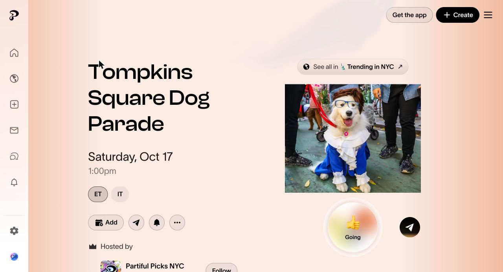
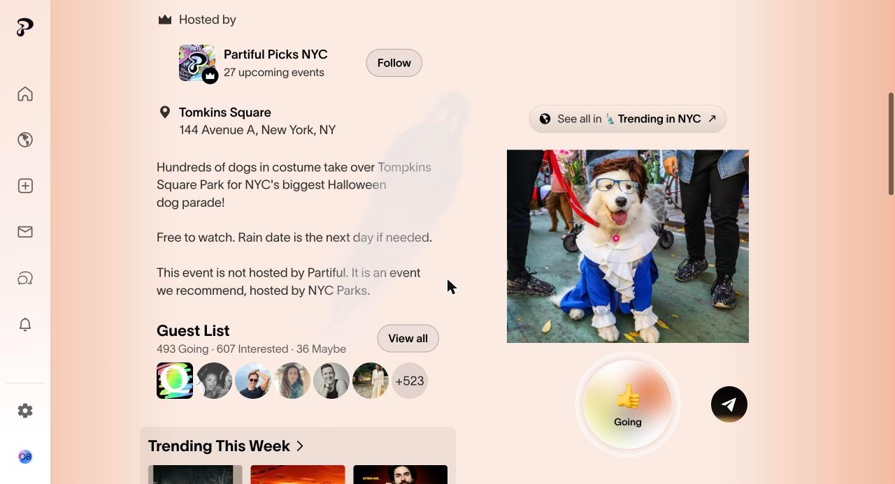
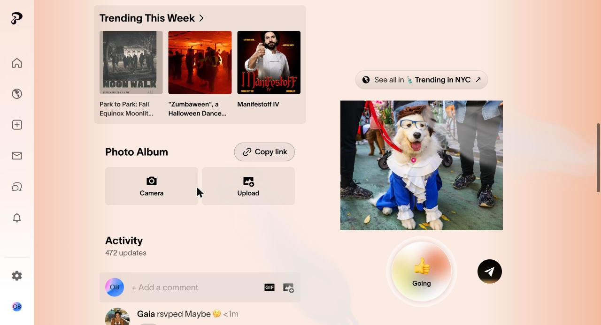
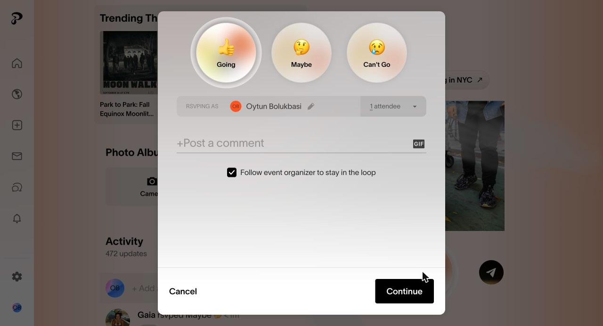
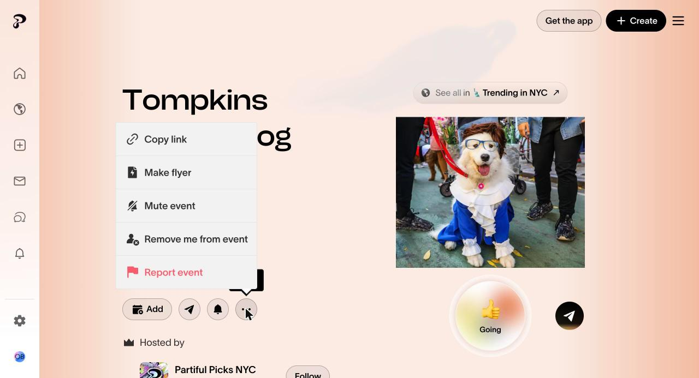
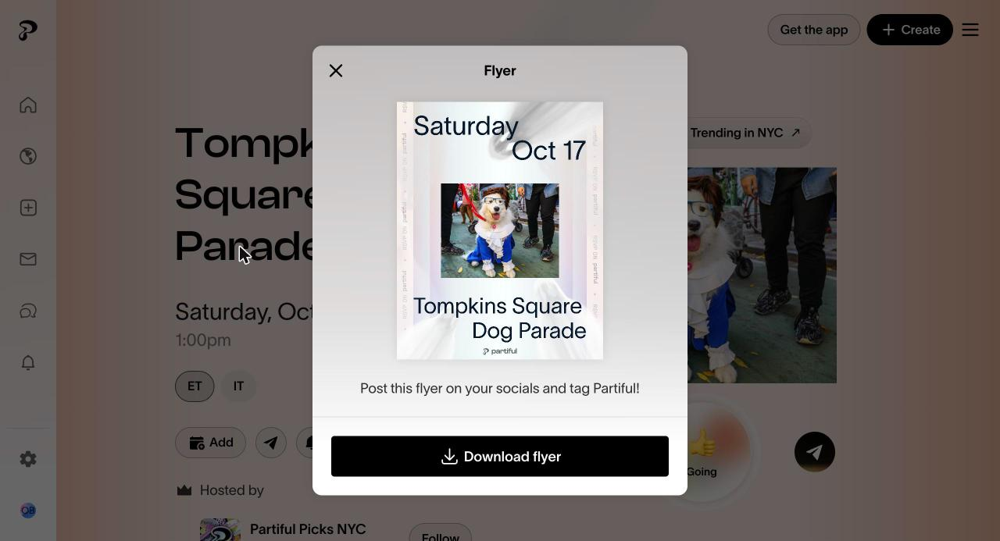
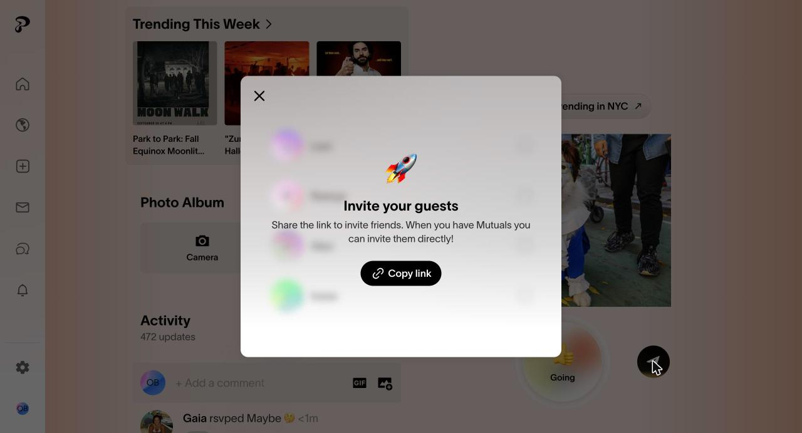

### 4.4 Create — login sonrası farklar
- "Hosted by" satırında gerçek profil + **"+ Add cohosts"** butonu doğrudan editörde.
- Alt bar yerine **sağ dikey panel**: Theme · Effect · Settings · Preview; sağ altta sabit **Save draft**.
- Poster alanı sürükle-bırak ("Drop it here!").

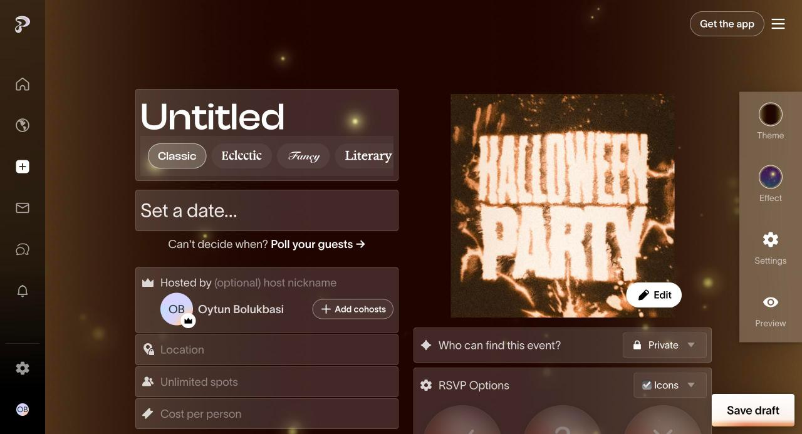

### 4.5 Tarih anketi — "Find a Time"
**Host tarafı (create'te "Can't decide when? Poll your guests →"):**
- Modal "Find a Time": serbest metin seçenek alanları (Option 1 "Fri Oct 2nd", Option 2 …) + **"+ Add another option"**, Cancel / Continue.
- Uyarı: **Chip-in ve Guest Approval ile birlikte kullanılamaz.**
- "How it works": 1) Misafirler her seçeneğe RSVP verir → 2) Host "Pick this" ile seçer, yanıtlar **otomatik Going / Maybe / Can't Go'ya dönüşür** → 3) Sonradan davet edilenler anket sürecini görmez.

**Misafir tarafı [HC]:** her seçeneğe **Yes / No / Maybe** oyu; seçim yapıldığında misafirlere bildirim gider. Seçim için en az bir yanıt gerekli.

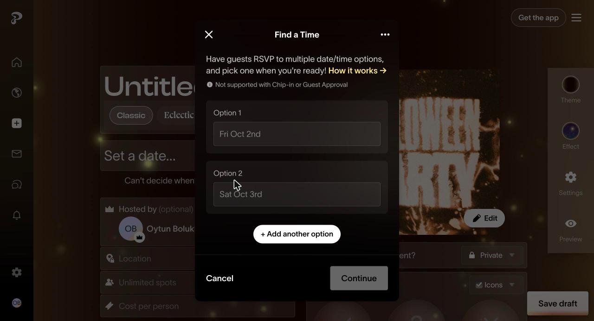
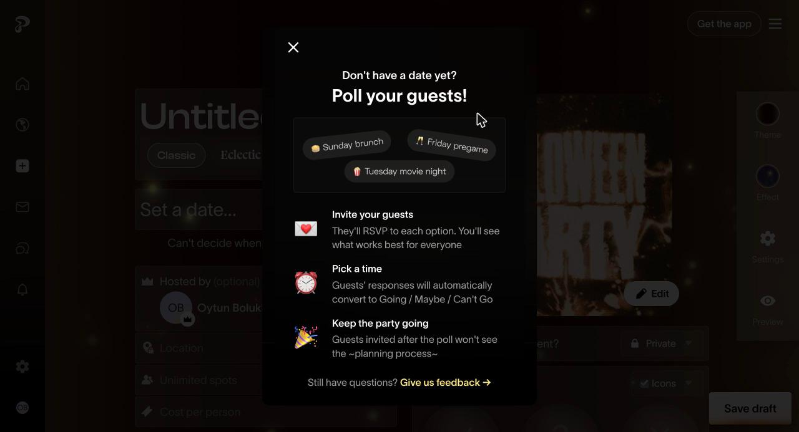

### 4.6 Event Settings (host kontrol paneli)
Modal, sol dikey sekmeler:

| Sekme | İçerik |
|---|---|
| **Hosts** | "Manage Hosts — Hosts can edit & manage this event, including adding/removing other cohosts". Creator · You, **+ Add cohost** (mutual listesinden, karşı taraf kabul edene kadar *Pending*), **Add Cohost Via Link** toggle (linke sahip herkes host olur). |
| **RSVPs** | Accept RSVPs · **Plus ones** (Up to N) + Require names · **Require Guest Approval** ("Get on the list") · **Max Capacity** (dolunca waitlist) · **Allow Guests to Invite Mutuals** · RSVP Button Style (Icons/Emojis) · Guests can RSVP "Maybe" · "Add a questionnaire" |
| **Chip in** | Off / **Required amount** / **Pay what you can**. Para birimi + kişi başı tutar + Venmo / Cash App / PayPal kullanıcı adları. Kırmızı uyarı: *"Payments are not verified. Guests self-report payment during RSVP."* Guest Approval ve Find a Time ile birlikte çalışmaz. |
| **Questionnaire** | Toggle → soru tipi (Short Answer …), Required, + Add question, Save. |
| **Display & Privacy** | "Guest List and Activity Feed are hidden pre-RSVP". Show Activity Timestamps · Show Guest Names · Show Guest Count · **Let Guests Send Crushes** · **Event Password** |
| **Audience** | Private (Only people with the link → "Invite-only") / Public (Anyone on or off Partiful). |
| **Photo Album** | "Only RSVP'd guests can view the Photo Album". **Apply a Filter to the Album** · Allow Guests to Upload · Open / Share Photo Album. |
| **Auto-Reminders** | "Enable automatic SMS reminders". Reminders to RSVP — 1 hafta önce (Invited, Maybe) · Event Reminders — 2 saat önce (Going). [HC] Kanal ülkeye göre SMS / iMessage / **WhatsApp**; uygulaması olana push. Program özelleştirilemiyor. |

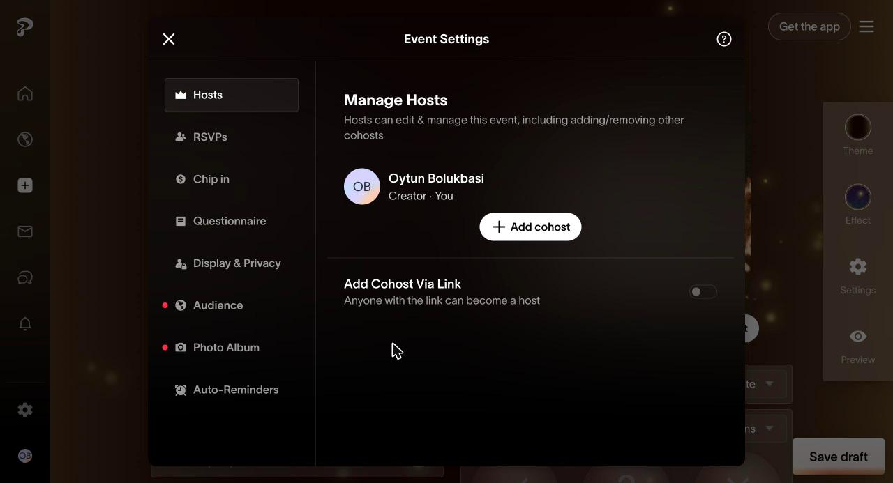
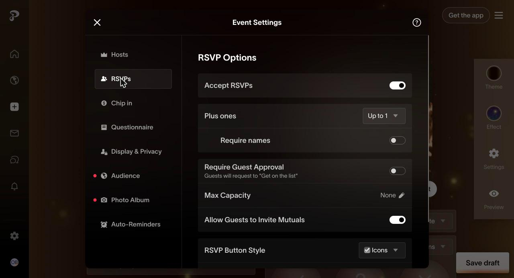
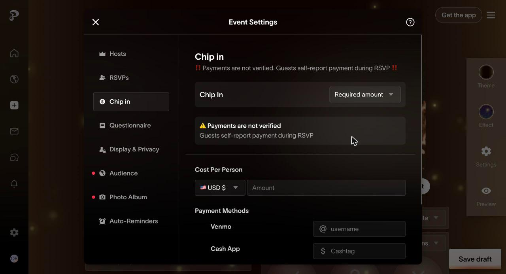
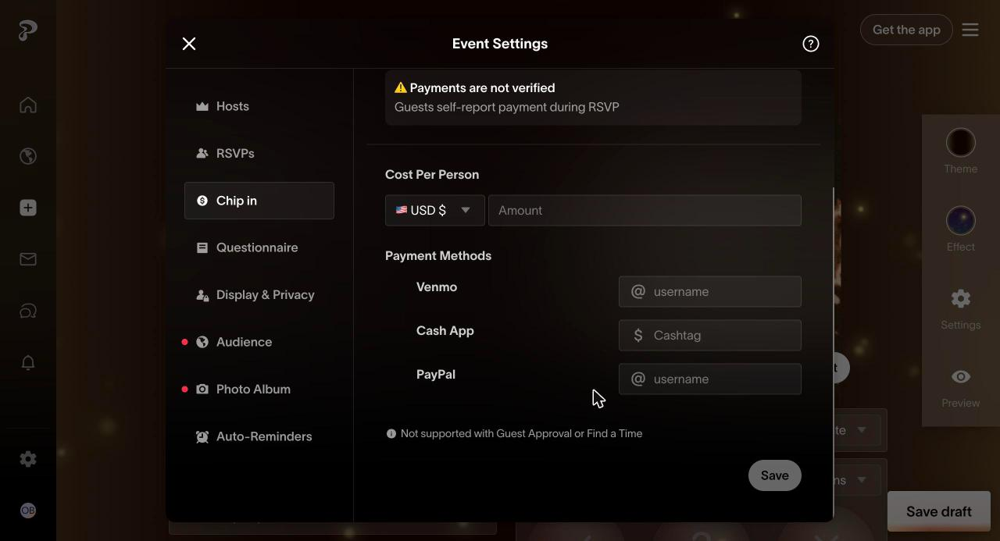
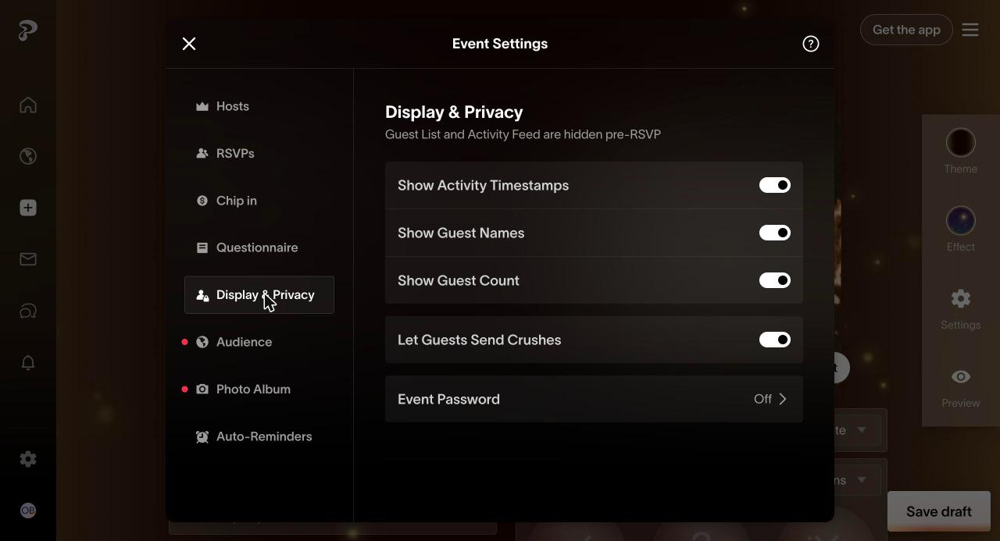
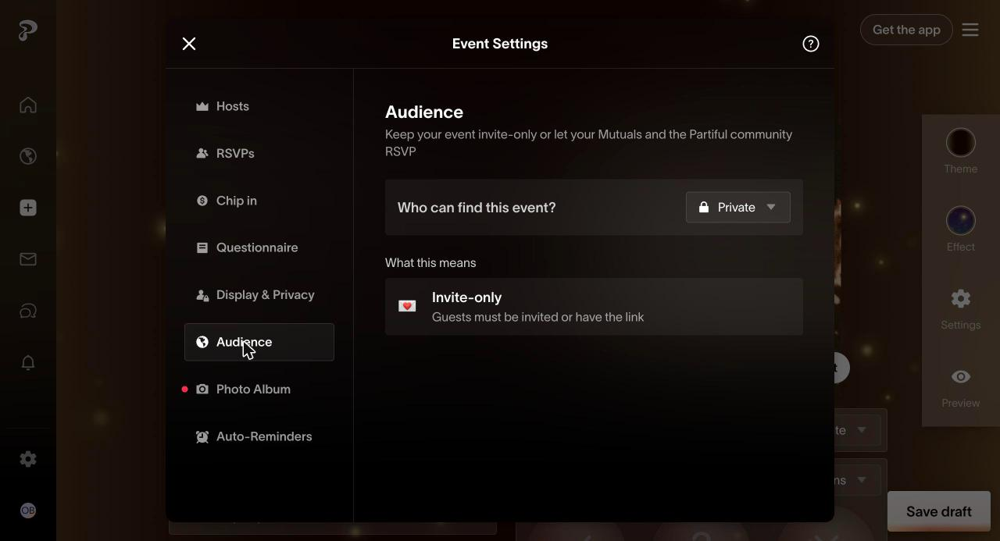
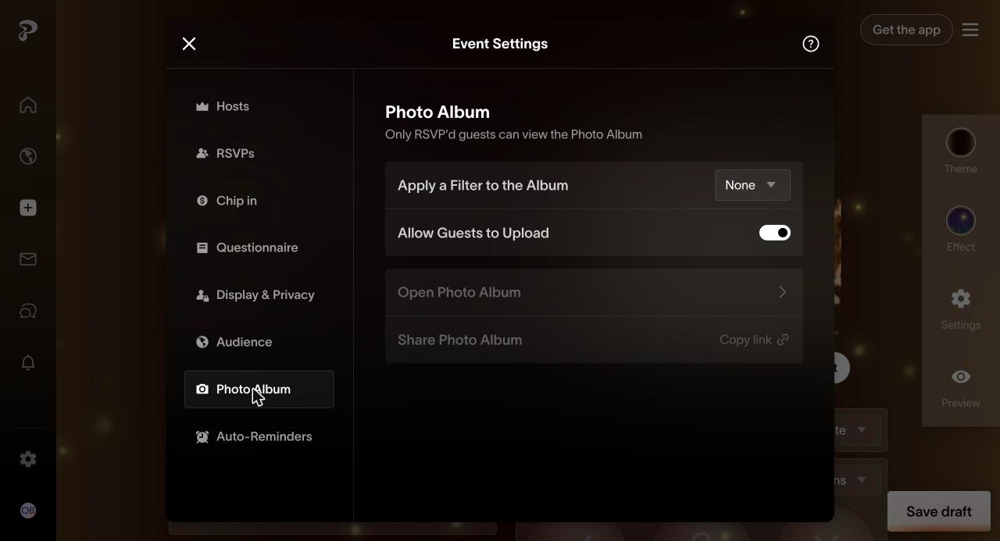
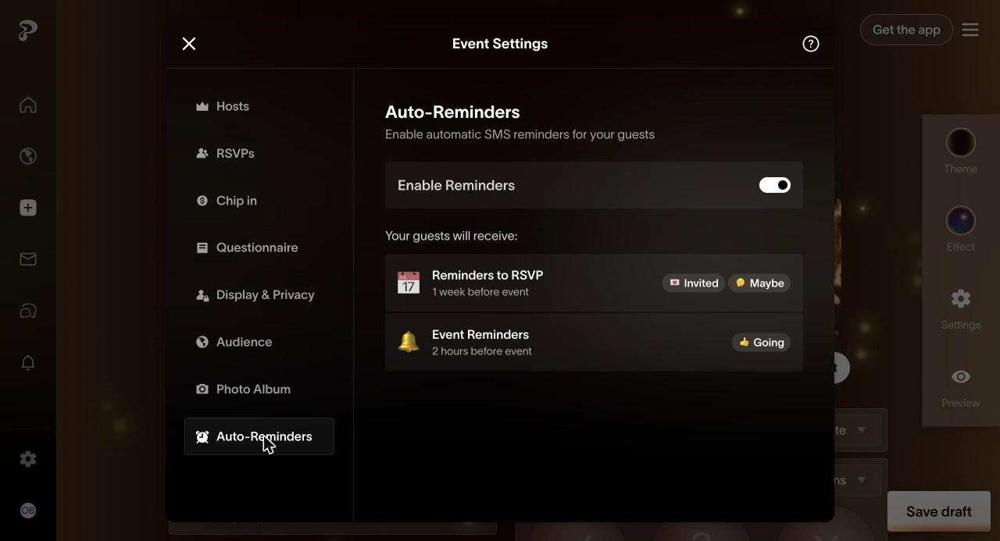

### 4.7 Host araçları — guest list, onay, Text Blast, check-in [HC]
*(Hesapta host edilen etkinlik yok; ekran görüntüsü alınamadı.)*
- **Davet:** etkinlik sayfasında "Invite" → Mutuals + geçmiş misafirler listesi, geçmiş etkinliğe göre filtre; uygulamada rehber senkronu; ayrıca Copy link / QR / e-posta daveti. Link ile gelenler "Invited" sayılmaz.
- **Guest list:** host yalnızca isim + RSVP durumunu görür, **telefon numarasını göremez**. CSV export, manuel misafir ekleme, misafir çıkarma, RSVP'yi host adına değiştirme.
- **Guest Approval:** guest toolbar'da isim → dropdown → "Approved"; toplu onay var. Waitlist ile birlikte çalışabilir; waitlist'ten otomatik çıkarma kapatılabilir.
- **Text Blast:** web'de sağ toolbar'da, mobilde altta. "New Blast" → mesaj → **hedef RSVP durumlarını seç** → Send. Etkinlik başına **en fazla 10 blast**, gönderildikten sonra düzenlenemez, yalnızca Partiful üzerinden davet edilmiş/RSVP vermiş kişilere gider. Tek misafire özel mesaj da mümkün.
- **Check-in (yalnızca web):** guest list → "Bulk actions" / ⚙︎ → "Check in guests" → arama + işaretle. Misafire bildirim gitmez, geri alınabilir. Check-in yapılanlara Text Blast ve CSV'de check-in durumu.
- **Co-host:** tüm ayarları düzenleyebilir ve Text Blast gönderebilir.

### 4.8 Profil, Mutuals, Messages, Bildirimler
- **Profil (`/u/{id}`):** avatar (kamera ile değiştir), isim, "🐣 Joined Sep '26", Edit profile. Düzenlemede: bio, **telefon ("Only visible to you")**, + Instagram / Twitter / Snapchat, "Celebrate your birthday" (doğum günü hatırlatması → app), Delete Account.
- **Switch profile:** kişisel profil + **"Create Org Profile"** (organizasyon profiline geçiş).
- **Mutuals (`/mutuals`):** "~everyone you've ever partied with~" — tablo: NAME · SHARED EVENTS. Boş durum: ⏳ "No Mutuals yet… but check back after your first event!"
- **Messages (inbox):** DM yalnızca mutual'larla; boş durum 🪩 "No one to message yet — Check back after your first event!" + Create event.
- **Notifications:** sidebar'dan açılan panel, "SEE ALL"; boş durum 🪩 "You deserve notifications — Go host an event!"
- **Profile Settings:** Account (Change Phone Number, Log Out, Delete Account) · **Notifications** (Events: RSVP Updates / Comments / Photo Uploads / Reactions / Event Reminders → All/Off; Social: Crush; Other: Event Picks for You, Perks & Giveaways, Seasonal Reminders; "block için profile git") · **Calendar Sync** (Google Calendar / iCalendar Connect; Waitlist / Pending approval / Invited etkinlikleri de senkronla) · Language · Accessibility (**Reduce Motion**) · About.

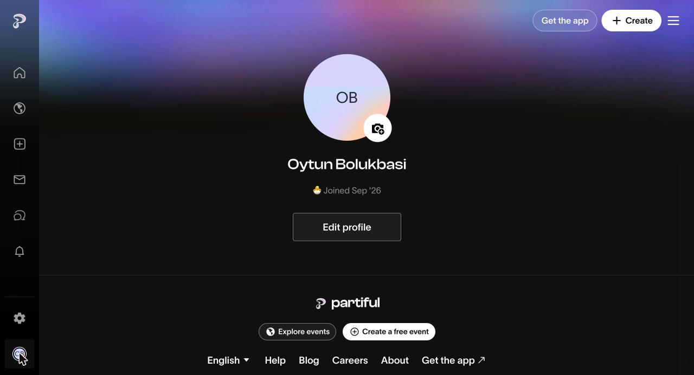
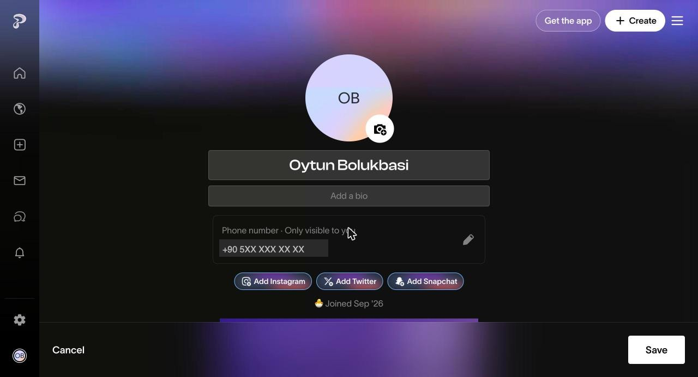
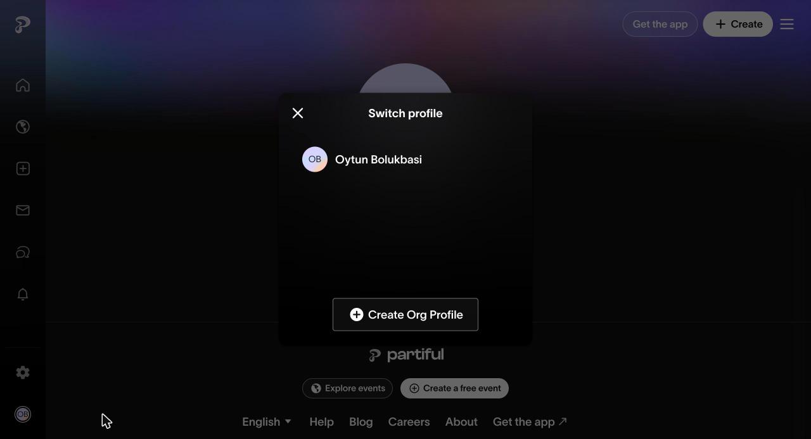
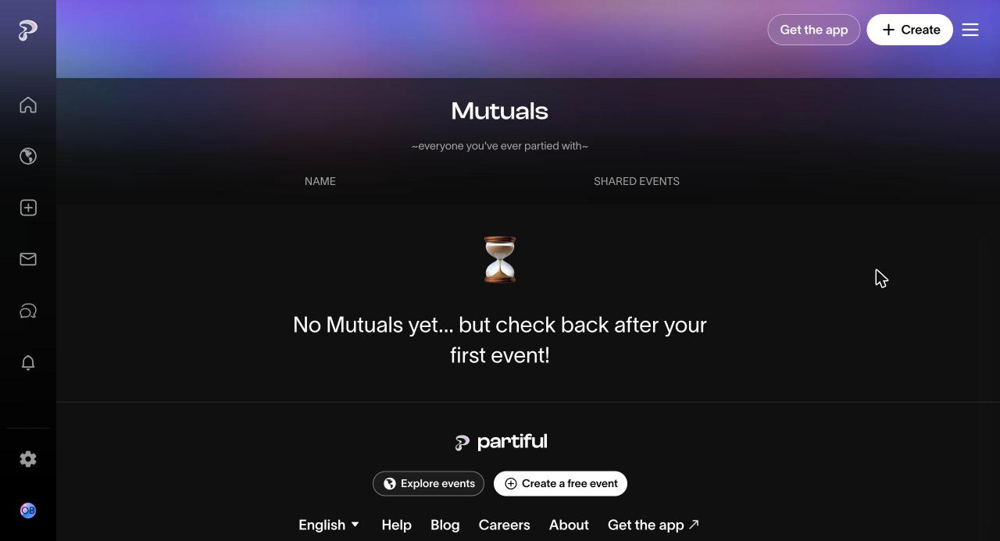
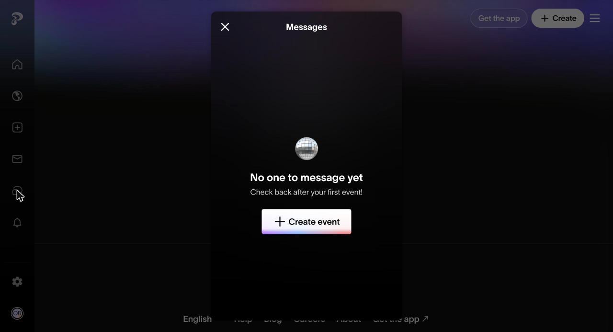
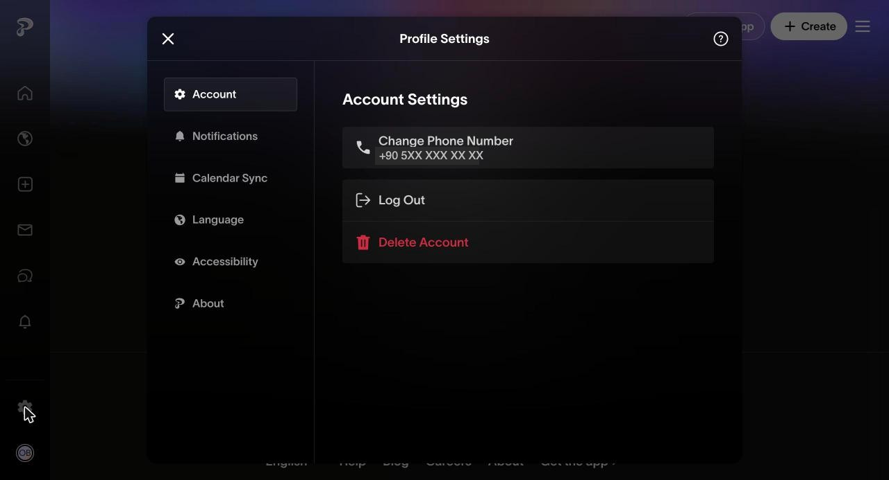
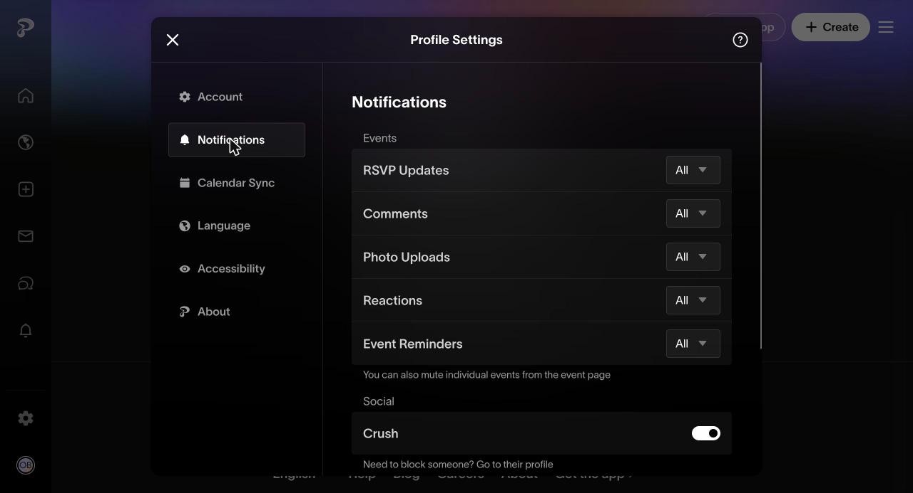
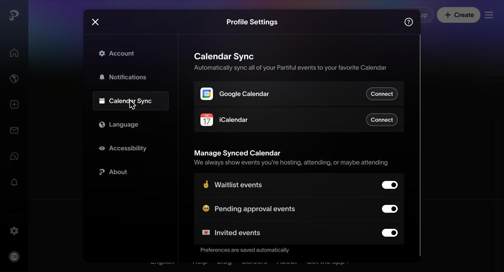

### 4.9 Cards (`/createCard`) — yeni ürün
- "Welcome to Cards — birthday wishes, announcements… Send digital cards to friends, lovers, and enemies." + "Hosting? Send an invite instead".
- Editör davetiye editörünün hafif versiyonu: "From {isim}", zarf içinde kart görseli (Change image), başlık + not, sağ panel **Theme · Font · Effect**, sağ üstte **Next**.
- Etkinlik dışı kullanım → uygulamaya dönüş sıklığını artıran bir "retention" özelliği.

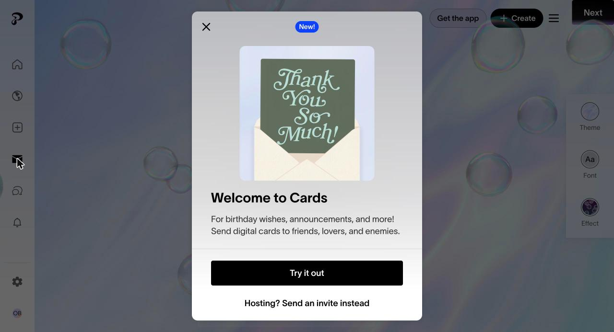
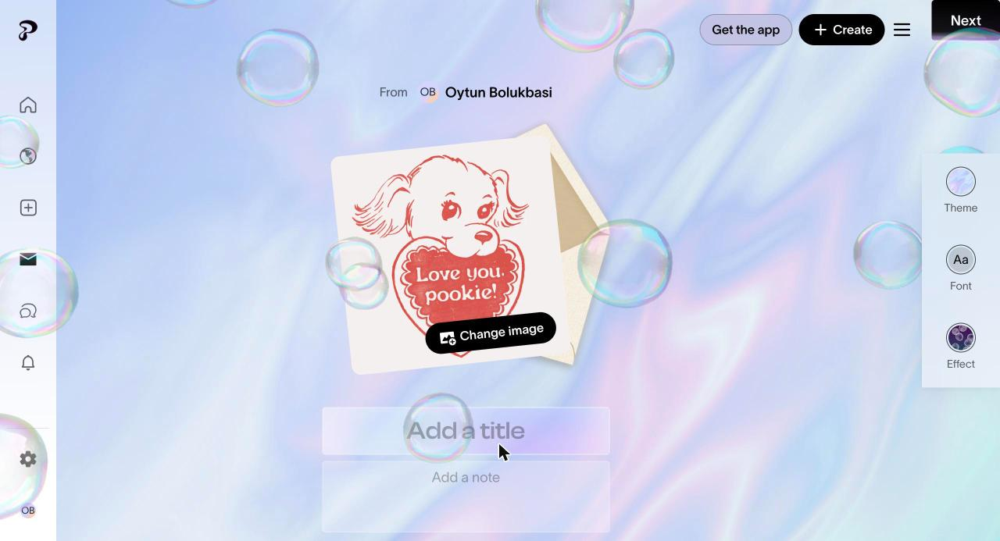

### 4.10 partile için çıkarımlar
1. **MVP'ye eklenecekler:** Make flyer (Story/WhatsApp durum görseli), Photo Album + filtre, activity feed'de otomatik RSVP satırları + Reply, "Follow organizer" kutusu, Mute event, Calendar sync (Google + .ics).
2. **Event Settings bilgi mimarisi aynen alınabilir:** Düzenleyenler · Katılım · Masrafı böl · Sorular · Görünürlük & Gizlilik · Kitle · Albüm · Hatırlatmalar.
3. **Masrafı böl (Chip in karşılığı):** Required / "Gönlünden ne koparsa"; Venmo/Cash App yerine **IBAN, Papara, ininal** alanları; "Ödemeler doğrulanmaz, misafir beyanıdır" uyarısı aynen. Anket ve katılım onayıyla aynı anda kapalı.
4. **Hatırlatmalar:** Partiful TR benzeri ülkelerde zaten WhatsApp kullanıyor → partile'de varsayılan kanal WhatsApp, fallback SMS.
5. **Gizlilik:** host misafir telefonunu görmez (KVKK ile birebir uyumlu); "Crush" ve "Event Password" Faz 2.
6. **Boş durumlar** (Mutuals, Messages, Notifications) hepsi "ilk etkinliğini oluştur" CTA'sına bağlanıyor → partile'de de her boş durum = Plan oluştur.
7. **Web'de olmayanlar:** Drafts sekmesi, Party Genie, tam guest list — Partiful bunları uygulamaya itiyor. partile web-first olduğu için bunları web'de de sunmak bir fark yaratır.

**Yeni terimler (3.1'e ek):** Chip in → *Masrafı böl* · Make flyer → *Afiş oluştur* · Mutuals → *Ortak arkadaşlar* · Crush → *Gizli beğeni* · Cards → *Kartlar* · Mute event → *Sessize al* · Text Blast → *Duyuru* · Check in → *Giriş kontrolü* · Waitlist → *Bekleme listesi* · Plus ones → *+1 misafir*.
